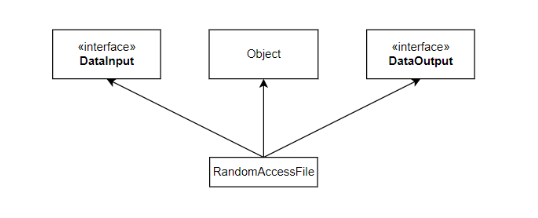

# 표준입출력과 File
## 1. 표준입출력 - System.in, System.out, System.err
* 표준입출력은 콘솔(console, 도스창)을 통한 데이터 입력과 콘솔로의 데이터 출력을 의미합니다.
* 자바에서는 표준 입출력(standard I/O)를 위해 3가지 입출력 스트림, System.in, System.out, System.err를 제공하는데. 이 들은 자바 어플리케이션의 실행과 동시에 사용할 수 있게 자동으로 생성되기 때문에 개발자가 별도로 스트림을 생성하는 코드를 작성하지 않고도 사용 가능합니다.
* 자바를 처음 시작할 때부터 지금까지 줄 곧 사용해온 System.out을 스트림의 생성없이 사용할 수 있었던 것이 바로 이러한 이유 때문이다.<br><br>
* 자바에서의 표준입출력
  > **System.in**  : 콘솔로부터 데이터를 입력받는데 사용(InputStream)\
  > **System.out** : 콘솔로 데이터를 출력하는데 사용(PrintStream)\
  > **System.err** : 콘솔로 데이터를 출력하는데 사용(PrintStream)
* System클래스의 소스에서 알 수 있듯이 in, out, err은 System클래스에 선언된 클래스변수(static변수)이다.
* 선언부분만을 봐서는 out, err, in의 타입은 InputStream과 PrintStream이지만 실제로는 버퍼를 이용하는 BufferedInputStream과 BufferedOutputStream의 인스턴스를 사용한다.
  ```java
  public final class System {
    public final static InputStream in = nullInputStream();
    public final static PrintStream out = nullPrintStream();
    public final static PrintStream err = nullPrintStream();
    ...
  }
  ```

> 위 표준입출력을 이용한 간단한 예제 : [InputOutput07_Ex01.java](./InputOutput07_Ex01.java)

<br>

---
## 2. 표준입출력의 대상변경 : setOut(), setErr(), setIn()
* 초기에는 System.in, System.out, System.err의 입출력대상이 콘솔화면이지만, setIn(), setOut(), setErr()를 사용하면 입출력을 콘솔 이외에 다른 입출력 대상으로 변경하는 것이 가능하다.

| 메서드                                 | 설 명                                  |
|-------------------------------------|--------------------------------------|
| static void setOut(PrintStream out) | System.out의 출력을 지정된 PrintStream으로 변경 |
| static void setErr(PrintStream err) | System.err의 출력을 지정한 PrintStream으로 변경 |
| static void setIn(InputStream in)   | System.in의 입력을 지정한 InputStream으로 변경  |

* 그러나 JDK1.5부터는 Scanner클래스가 제공되면서 System.in으로부터 데이터를 입력받아 작업한느 것이 편리해졌다.
> 위 표준입출력을 이용한 예제 1 : [InputOutput07_Ex02.java](./InputOutput07_Ex02.java)\
> 위 표준입출력을 이용한 예제 2 : [InputOutput07_Ex03.java](./InputOutput07_Ex03.java)

<br>

---
## 3. RandomAccessFile
* 자바에서는 입력과 출력이 각각 분리되어 별도로 작업을 하도록 설계되어 있는데, RandomAccessFile만은 하나의 클래스로 파일에 대한 입력과 출력을 모두 할 수 있도록 되어 있다.
* InputStream이나 OutputStream으로부터 상속받지 않고, DataInput인터페이스와 DataOutput인터페이스를 모두 구현했기 때문에 읽기와 쓰기가 모두 가능하다.
  
* 사실 DataInputStream은 DataInput인터페이스를, DataOutputStream은 DataOutput인터페이스를 구현했다. 이 두 클래스의 기본 자료형(primitive data type)을 읽고 쓰기위한 메서드들은 모두 이 2개의 인터페이스에 정의되어있는 것들이다.
* 따라서, RandomAccessFile클래스도 DataInputStream과 DataOutputStream처럼 기본자료형 단위로 데이터를 읽고 쓸 수 있다.
* 그래도 역시 RandomAccessFile클래스의 가장 큰 장점은 파일의 어느 위치에나 읽기/쓰기가 가능하다는 것이다. 다른 입출력 클래스들은 입출력소스에 순차적으로 읽기/쓰기를 하기 때문에 읽기와 쓰기가 제한적인데 반해서 RandomAccessFile클래스는 파일에 읽고 쓰는 위치에 제한이 없다.
* 이것을 가능하게 하기 위해서 내부적으로 파일 포인터를 사용하는데, 입출력 시에 작업이 수행되는 곳이 바로 파일 포인터가 위치한 곳이 된다.
* 파일 포인터의 위치는 파일의 제일 첫 부분(0부터 시작)이며, 읽기 또는 쓰기를 수행할때 마다 작업이 수행된 다음 위치로 이동하게 된다. 순차적으로 읽기나 쓰기를 한다면, 파일 포인터를 이동시키기 위해 별도의 작업이 필요하지 않지만, 파일의 임의의 위치에 있는 내용에 대해서 작업하고자 한다면, 먼저 파일 포인터를 원하는 위치로 옮긴 다음 작업을 해야 한다.

  | 생성자 / 메서드                                                                                       | 설 명                                                                                                                                                                                                                                                                            |
  |-------------------------------------------------------------------------------------------------|--------------------------------------------------------------------------------------------------------------------------------------------------------------------------------------------------------------------------------------------------------------------------------|
  | RandomAccessFile(File file, String mode)<br/>RandomAccessFile(String fileName, String<br/>mode) | 주어진 file에 읽기 또는 읽기와 쓰기를 하기 위한<br/>RandomAccessFile인스턴스를 생성한다. mode의 값<br/>은 "r","rw","rws","rwd"가 지정가능하다.<br/>"r" - 파일로부터 읽기(r)만을 수행할 때<br/>"rw" - 파일에 읽기(r)와 쓰기(w)<br/>"rws"와 "rwd"는 기본적으로 "rw"와 같은데, 출력내용<br/>이 파일에 지연 없이 바로 쓰이게 한다. "rwd"는 파일<br/>내용만, "rws"는 파일의 메타정보도 포함. |
  | FileChannel getChannel()                                                                        | 파일의 파일 채널을 반환한다.                                                                                                                                                                                                                                                               |
  | FileDescriptor getFD()                                                                          | 파일의 파일 디스크립터를 반환                                                                                                                                                                                                                                                               |
  | long getFilePointer()                                                                           | 파일 포인터의 위치를 알려준다.                                                                                                                                                                                                                                                              |
  | long length()                                                                                   | 파일의 크기를 얻을 수 있다(단위 byte)                                                                                                                                                                                                                                                       |
  | void seek(long pos)                                                                             | 파일 포인터의 위치를 변경한다. 위치는 파일의 첫 부<br/>분부터 pos크기만큼 떨어진 곳이다.(단위 byte)                                                                                                                                                                                                                |
  | void setLength(long newLength)                                                                  | 파일의 크기를 지정된 길이로 변경한다.(byte단위)                                                                                                                                                                                                                                                  |
  | int skipBytes(int n)                                                                            | 지정된 수만큼의 byte를 건너뛴다.                                                                                                                                                                                                                                                           |
  * 사실 모든 입출력에 사용되는 클래스들은 입출력 시 다음 작업이 이루어질 위치를 저장하고 있는 포인터를 내부적으로 갖고 있다. 다만 내부적으로만 사용될 수 있기 때문에 작업자가 포인터의 위치를 마음대로 변경할 수 없다는 것이 RandomAccessFile과 다른점이다.
  * RandomAccessFile의 인스턴스를 "rw" mode로 생성할 때, 지정된 파일이 없으면 새로운 파일을 생성한다.

> RandomAccessFile을 이용한 간단한 예제 : [InputOutput07_Ex04.java](./InputOutput07_Ex04.java)\
> RandomAccessFile을 이용한 간단한 예제 : [InputOutput07_Ex05.java](./InputOutput07_Ex05.java)\
> RandomAccessFile을 이용한 간단한 예제 : [InputOutput07_Ex06.java](./InputOutput07_Ex06.java)

<br>

---
## 4. File
* 파일은 기본적이면서도 가장 많이 사용되는 입출력 대상이기 때문에 중요하다. 자바에서는 File클래스를 통해서 파일과 디렉토리를 다룰 수 있도록 하고 있다. 그래서 File인스턴스는 파일 일 수도 있고 디렉토리일 수도 있다.
* File의 생성자와 경로와 관련된 메서드

  | 생성자 / 메서드                                                                       | 설 명                                                                                                                                                                                               |
  |---------------------------------------------------------------------------------|---------------------------------------------------------------------------------------------------------------------------------------------------------------------------------------------------|
  | File(String fileName)                                                           | 주어진 문자열(fileName)을 이름으로 갖는 파일을 위한<br/>File인스턴스를 생성한다. 파일 뿐만 아니라 디렉토리도 같<br/>은 방법으로 다룬다.<br/>여기서 fileName은 주로 경로(path)를 포함해서 지정해주<br/>지만, 파일 이름만 사용해도 되는 데 이 경우 프로그램이<br/>실행되는 위치가 경로(path)로 간주된다. |
  | File(String pathName, String fileName)<br/>File(File pathName, String fileName) | 파일의 경로와 이름을 따로 분리해서 지정할 수 있도록 한<br/>생성자. 이 중 두 번째 것은 경로를 문자열이 아닌 File인스<br/>턴스인 경우를 위해서 제공된 것이다.                                                                                                  |
  | File(URI uri)                                                                   | 지정된 url로 파일을 생성                                                                                                                                                                                   |
  | String getName()                                                                | 파일이름을 String으로 반환                                                                                                                                                                                 |
  | String getPath()                                                                | 파일의 경로(path)를 String으로 반환                                                                                                                                                                         |
  | String getAbsolutePath()<br/>File getAbsoluteFile()                             | 파일의 절대경로를 String으로 반환<br/>파일의 절대경로를 File로 반환                                                                                                                                                      |
  | String getParent()<br/>File getParentFile()                                     | 파일의 조상 디렉토리를 String으로 반환<br/>파일의 조상 디렉토리를 File로 반환                                                                                                                                                |
  | String getCanonicalPath()<br/>File getCanonicalFile()                           | 파일의 정규경로를 String으로 반환<br/>파일의 정규경로를 File로 반환                                                                                                                                                      |

<br>

* 경로와 관련된 File의 멤버변수

  | 멤버변수                          | 설 명                                           |
  |-------------------------------|-----------------------------------------------|
  | static String pathSeparator   | OS에서 사용하는 경로(path) 구분자. 윈도우";", 유닉스 ":"       |
  | static char pathSeparatorChar | OS에서 사용하는 경로(path) 구분자.<br/>윈도우에서는 ';', 유닉스':' |
  | static String separator       | OS에서 사용하는 이름 구분자. 윈도우 "￦", 유닉스 "/"            |
  | static char separatorChar     | OS에서 사용하는 이름 구분자. 윈도우 "￦", 유닉스 "/"            |

  * 파일의 경로(path)와 디렉토리나 파일의 이름을 구분하는 데 사용되는 구분자가 OS마다 다를 수 있기 때문에, OS 독립적으로 프로그램을 작성하기 위해서는 반드시 위의 멤버변수들을 이용해야 한다. 만일 윈도우에서 사용하는 구분자를 코드에 직접 적어 놓았다면, 이 코드는 다른 OS에서는 오류를 일으킬 수 있다.
>  File인스턴스 생성과 메서드를 이용한 간단한 예제 : [InputOutput07_Ex07.java](./InputOutput07_Ex07.java)

<br>

* File의 메서드

  | 메서드                                                                                                                                                                                                                                                                                                                                                | 설 명                                                                                                                                                |
  |----------------------------------------------------------------------------------------------------------------------------------------------------------------------------------------------------------------------------------------------------------------------------------------------------------------------------------------------------|----------------------------------------------------------------------------------------------------------------------------------------------------|
  | boolean canRead()                                                                                                                                                                                                                                                                                                                                  | 읽을 수 있는 파일인지 검사한다.                                                                                                                                 |
  | boolean canWrite()                                                                                                                                                                                                                                                                                                                                 | 쓸 수 있는 파일인지 검사한다.                                                                                                                                  |
  | boolean canExecute()                                                                                                                                                                                                                                                                                                                               | 실행할 수 있는 파일인지 검사한다.                                                                                                                                |
  | int compareTo(File pathname)                                                                                                                                                                                                                                                                                                                       | 주어진 파일 또는 디렉토리를 비교한다. 같으면 0을 반환하며, 다<br/>르면 1또는 -1을 반환한다.(Unix 시스템에서는 대소문자를 구별하<br/>며, Windows에서는 구별하지 않는다.)                                       |
  | boolean exists()                                                                                                                                                                                                                                                                                                                                   | 파일이 존재하는지 검사한다.                                                                                                                                    |
  | boolean isAbsolute()                                                                                                                                                                                                                                                                                                                               | 파일 또는 디렉토리가 절대경로명으로 지정되었는지 확인한다.                                                                                                                   |
  | boolean isDirectory()                                                                                                                                                                                                                                                                                                                              | 디렉토리인지 확인한다.                                                                                                                                       |
  | boolean isFile()                                                                                                                                                                                                                                                                                                                                   | 파일인지 확인한다.                                                                                                                                         |
  | boolean isHidden()                                                                                                                                                                                                                                                                                                                                 | 파일의 속성이 '숨김(Hidden)'인지 확인한다.<br/>또한 파일이 존재하지 않으면 false를 반환한다.                                                                                      |
  | boolean createNewFile()                                                                                                                                                                                                                                                                                                                            | 아무런 내용이 없는 새로운 파일을 생성한다.(단, 생성하려는 파일<br/>이 이미 존재하면 생성되지 않는다)<br/>File f = new File("c:\\jdk1.8\\work\\test.java");<br/>f.createNewFile();          |
  | static File createTempFile<br/>(String prefix, String suffix)                                                                                                                                                                                                                                                                                      | 임시파일을 시스템의 임시 디렉토리에 생성한다.<br/>System.out.println(File.createTempFile("work","tmp"));<br/>결과 : c:\windows\TEMP\work14247.tmp                        |
  | static File createTempFile<br/>(String prefix, String suffix, File<br/>directory)                                                                                                                                                                                                                                                                  | 임시파일을 시스템의 지정된 디렉토리에 생성한다.                                                                                                                         |
  | boolean delete()                                                                                                                                                                                                                                                                                                                                   | 파일을 삭제한다.                                                                                                                                          |
  | void deleteOnExit()                                                                                                                                                                                                                                                                                                                                | 응용 프로그램 종료시 파일을 삭제한다. 주로 실행 시 작업에 사용<br/>된 임시파일을 삭제하는데 사용된다.                                                                                       |
  | boolean equals(Object obj)                                                                                                                                                                                                                                                                                                                         | 주어진 객체(주로 File인스턴스)가 같은 파일인지 비교한다. (Unix<br/>시스템에서는 대소문자를 구별하며, Windows에서는 구별하지 않<br/>는다.)                                                         |
  | long lastModified()                                                                                                                                                                                                                                                                                                                                | 파일의 마지막으로 수정된 시간을 지정된 시간을 반환                                                                                                                       |
  | long length()                                                                                                                                                                                                                                                                                                                                      | 파일의 크기를 반환한다.                                                                                                                                      |
  | String[] list()                                                                                                                                                                                                                                                                                                                                    | 디렉토리의 파일목록(디렉토리 포함)을 String배열로 반환한다.                                                                                                               |
  | String[] list(FilenameFilter filter)<br/>File[] list(FilenameFilter filter)                                                                                                                                                                                                                                                                        | FilenameFilter인스턴스에 구현된 조건에 맞는 파일을 String배열<br/>(File배열)로 반환한다.                                                                                    |
  | File[] listFiles()<br/>File[] listFiles(FileFilter filter)<br/>File[] listFiles(FilenameFilter f)                                                                                                                                                                                                                                                  | 디렉토리의 파일목록(디렉토리 포함)을 File배열로 반환(filter가<br/>지정된 경우에는 filter의 조건과 일치하는 파일만 반환)                                                                      |
  | static File[] listRoots()<br/>long getFreeSpace()<br/>long getTotalSpace()<br/>long getUsableSpace()                                                                                                                                                                                                                                               | 컴퓨터의 파일시스템의 root의 목록(floppy, CD-ROM, HDD<br/>drive)을 반환(예: A:\, D:\)<br/>get으로 시작하는 메서드들은 File이 root일 때, 비어있는 공간, 전<br/>체 공간, 사용가능한 공간을 바이트 단위로 반환 |
  | boolean mkdir()<br/>boolean mkdirs()                                                                                                                                                                                                                                                                                                               | 파일에 지정된 경로로 디렉토리(폴더)를 생성, 성공하면 true<br/>mkdirs는 필요하면 부모 디렉토리까지 생성                                                                                  |
  | boolean renameTo(file dest)                                                                                                                                                                                                                                                                                                                        | 지정된 파일(dest)로 이름을 변경                                                                                                                               |
  | boolean setExecutable(boolean executable)<br/>boolean setExecutable(boolean executable, boolean ownerOnly)<br/>boolean setReadable(boolean readable)<br/>boolean setReadable(boolean readable, boolean ownerOnly)<br/>boolean setReadOnly()<br/>boolean setWritable(boolean writable)<br/>boolean setWritable(boolean writable, boolean ownerOnly) | 파일의 속성을 변경한다.<br/>OwnerOnly가 true면, 파일<br/>의 소유자만 해당 속성을 변<br/>경할 수 있다.                                                                            |
  | boolean setLastModified(long t)                                                                                                                                                                                                                                                                                                                    | 파일의 마지막으로 수정된 시간을 지정된 시간(t)으로 변경                                                                                                                   |
  | Path toPath()                                                                                                                                                                                                                                                                                                                                      | 파일을 Path로 변환해서 반환                                                                                                                                  |
  | URI toURI()                                                                                                                                                                                                                                                                                                                                        | 파일을 URI로 변환해서 반환                                                                                                                                   |

> File 클래스를 이용한 간단한 예제 1 : [InputOutput07_Ex08.java](./InputOutput07_Ex08.java)\
> File 클래스를 이용한 간단한 예제 2 : [InputOutput07_Ex09.java](./InputOutput07_Ex09.java)
