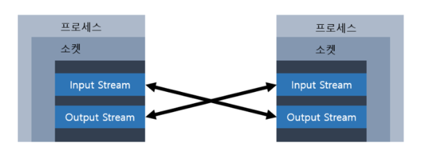

# 네트워킹(Networking)
## 1. 네트워킹(Networking)이란?
* 네트워킹(Networking)이란 두 대 이상의 컴퓨터를 케이블로 연결하여 네트워크(network)를 구성하는 것을 말한다. 네트워킹의 개념은 컴퓨터들을 서로 연결하여 데이터를 손쉽게 주고받거나 또는 자원프린터와 같은 주변기기를 함께 공유하고자 하는 노력에서 시작되었다.
* 초기의 네트워크는 단 몇 대의 컴퓨터로 구성되었으나 지금은 전 세계의 셀 수도 없을만큼 많은 수의 컴퓨터가 인터넷이라는 하나의 거대한 네트워크를 구성하고 있으며, 인터넷을 통해 다양하고 방대한 양의 데이터를 공유하는 것이 가능해졌다.
* 이에 맞춰 메신저나 온라인게임과 같은 인터넷을 이용하는 다양한 네트워크 어플리케이션들이 많이 생겨났다.
* 자바에서 제공하는 java.net패키지를 사용하면 이러한 네트워크 어플리케이션의 데이터통신 부분을 쉽게 작성할 수 있으며, 간단한 네트워크 어플리케이션은 단 몇 줄의 자바코드 만으로도 작성이 가능하다.
***
<br>

### 1.1 클라이언트/서버(client/server)
* '클라이언트/서버'는 컴퓨터간의 관계를 역할로 구분하는 개념이다. 서버(server)는 서비스를 제공하는 컴퓨터(service provider)이고, 클라이언트(client)는 서비스를 사용하는 컴퓨터(service user)가 된다.
* 일반적으로 서버는 다수의 클라이언트에게 서비스를 제공하기 때문에 고사양의 하드웨어를 갖춘 컴퓨터이지만, 하드웨어의 사양으로 서버와 클라이언트를 구분하는 것이 아니기때문에 하드웨어의 사양에 관계없이 서비스를 제공하는 소프트웨어가 실행되는 컴퓨터를 서버라 한다.
* 서비스는 서버가 클라이언트로부터 요청받은 작업을 처리하여 그 결과를 제공하는 것을 뜻하며 서버가 제공하는 서비스의 종류에 따라 파일서버(file server), 메일서버(mail server), 어플리케이션 서버(application server)등이 있다. 예를 들어 파일서버(file server)는 클라이언트가 요청한 파일을 제공하는 서비스를 수행한다.
* 서버에 접속하는 클라이언트의 수에 따라 하나의 서버가 여러 가지 서비스를 제공하기도하고 하나의 서비스를 여러 대의 서버로 제공하기도 한다.
* 서버가 서비스를 제공하기 위해서는 서버프로그램이 있어야 하고 클라이언트가 서비스를 제공받기 위해서는 서버프로그램과 연결할 수 있는 클라이언트 프로그램이 있어야 한다.
  * ex) 웹서버에 접속하여 정보를 얻기 위해서는 웹브라우저(클라이언트 프로그램)가 있어야 하고, FTP서버에 접속해서 파일을 전송받기 위해서는 알FTP와 같은 FTP클라이언트 프로그램이 필요하다.
* 일반 PC의 경우 주로 서버에 접속하는 클라이언트 역할을 수행하지만, FTP Serv-U와 같은 FTP서버프로그램이나 Tomcat과 같은 웹서버프로그램을 설치하면 서버역할도 수행 할 수 있다.
* 파일공유프로그램인 소리바다나 푸르나와 같은 프로그램은 클라이언트프로그램과 서버프로그램을 하나로 합친 것으로 이를 설치한 컴퓨터는 클라이언트인 동시에 서버가 되어 다른 컴퓨터로부터 파일을 가져오는 동시에 또 다른 컴퓨터에게 파일을 제공할 수 있다.
* 네트워크를 구성할 때 전용서버를 두는 것을 서버기반모델(server-based model)이라하고 별도의 전용서버없이 각 클라이언트가 서버역할을 동시에 수행하는 것을 P2P모델(peer-to-peer)이라 한다.
* 서버기반 모델과 P2P모델간의 비교

  | 서버기반 모델(server-based model)                                            | P2P 모델(peer-to-peer model)                                                      |
  |------------------------------------------------------------------------|---------------------------------------------------------------------------------|
  | -안정적인 서비스의 제공이 가능하다.<br/> -공유 데이터의 관리와 보안이 용이하다.<br/>서버구축비용과 관리비용이 든다. | -서버구축 및 운용을 절감할 수 있다.<br/>-자원의 활용을 극대화 할 수 있다.<br/>-자원의 관리가 어렵다.<br/>-보안이 취약하다. |

***
<br>

### 1.2 IP 주소(IP address)
* IP주소는 컴퓨터(호스트, host)를 구별하는데 사용되는 고유한 값으로 인터넷에 연결된 모든 컴퓨터는 IP주소를 갖는다. IP주소는 4 byte(32 bit)의 정수로 구성되어 있으며, 4개의 정수가 마침표를 구분자로'a.b.c.d'와 같은 형식으로 표현된다. 여기서 a, b, c, d는 부호없는 1 byte값, 즉 0~255사이의 정수이다.
* IP주소는 다시 네트워크주소와 호스트주소로 나눌 수 있는데, 32 bit(4 byte)의 IP주소중에서 네트워크주소와 호스트주소가 각각 몇 bit를 차지하는 지는 네트워크를 어떻게 구성하였는지에 따라 달라진다. 그리고 서로 다른 두 호스트의 IP주소의 네트워크주소가 같다는 것은 두 호스트가 같은 네트워크에 포함되어 있다는 것을 의미한다.
* 윈도우즈 OS에서 호스트의 IP주소를 확인하려면 콘솔에서 ipconfig.exe를 실행시키면 된다.
  ```shell
  C:\Documents and Settings\Adminstrator>ipconfig
  
  Windows IP Configuration
  
  Ethernet adapter 로컬 영역 연결:
  
          Connection-specific DNS Suffix  . :
          IP Address. . . . . . . . . . . . . : 192.168.10.100
          Subnet Mask . . . . . . . . . . . . : 255.255.255.0
          Default Gateway . . . . . . . . . . : 192.168.10.1
          
  C:\Documents and Settings\Adminstrator>
  ```
<br>

* 위의 결과에서 얻은 IP주소와 서브넷 마스크를 2진수로 표현하면 다음과 같다.
  <br>(IP주소(192.168.10.100)와 서브넷 마스크(255.255.255.0)의 2진법 표기)
  

<br>

* IP주소와 서브넷 마스크를 비트연산자 '&'로 연산하면 IP주소에서 네트워크 주소만을 뽑아낼 수 있다.
  <br>(IP주소(192.168.10.100)와 서브넷 마스크(255.255.255.0)의 &연산)
  

<br>

* '&'연산자는 bit와 값이 모두 1일 때만 1을 결과로 얻기 때문에 IP주소의 마지막 8 bit는 모두 0이 되었다. 이 결과로부터 IP주소 192.168.10.100의 네트워크 주소는 24bit(192.168.10)이라는 것과 호스트 주소는 마지막 8bit(100)이라는 것을 알 수 있다.
* IP주소에서 네트워크주소가 차지하는 자리수가 많을수록 호스트 주소의 범위가 줄어들기 때문에 네트워크의 규모가 작아진다. 이 경우 호스트 주소의 자리수가 8자리이기 때문에 256개(2의 8승)의 호스트만 이 네트워크에 포함될 수 있다.
* 호스트 주소가 0인 것은 네트워크 자신을 나타내고, 255는 브로드캐스트 주소로 사용되기 때문에 실제로는 네트워크에 포함 가능한 호스트 개수는 254개이다.

<br>

* 이처럼 IP주소와 서브넷 마스크를 '&'연산하면 네트워크 주소를 얻어낼 수 있어서 서로 다른 두 호스트의 IP주소를 서브넷 마스크로 '&'연산을 수행해서 비교하면 이 두 호스트가 같은 네트워크 상에 존재하는지를 쉽게 확인할 수 있다.

***
<br>

### 1.3 InetAddress
* 자바에서는 IP주소를 다루기 위한 클래스로 InetAddress를 제공하며 다음과 같은 메서드가 정의되어 있다.

<br>
* InetAddress의 메서드

  | 메서드                                                | 설명                                             |
  |----------------------------------------------------|------------------------------------------------|
  | byte[] getAddress()                                | IP주소를 byte배열로 반환한다.                            |
  | static InetAddress[]<br/>getAllByName(String host) | 도메인명(host)에 지정된 모든 호스트의 IP주소를 배열에<br/>담아 반환한다. |
  | static InetAddress getByAddress(byte[]<br/>addr)   | byte배열을 통해 IP주소를 얻는다.                          |
  | static InetAddress<br/>getByName(String host)      | 도메인명(host)을 통해 IP주소를 얻는다.                      |
  | String getCanonicalHostName()                      | FQDN(fully qualified domain name)을 반환한다.       |
  | String getHostAddress()                            | 호스트의 IP주소를 반환한다.                               |
  | String getHostName()                               | 호스트의 이름을 반환한다.                                 |
  | static InetAddress getLocalHost()                  | 지역호스트의 IP주소를 반환한다.                             |
  | boolean isMulticastAddress()                       | IP주소가 멀티캐스트 주소인지 알려준다.                         |
  | boolean isLoopbackAddress()                        | IP주소가 loopback 주소(127.0.0.1)인지 알려준다.           |

> InetAddress의 주요 메서드들을 활용하는 예제 : [Network01_Ex01](./Network01_Ex01.java)
***
<br>

### 1.4 URL(Uniform Resource Locator)
* URL은 인터넷에 존재하는 여러 서버들이 제공하는 자원에 접근할 수 있는 주소를 표현하기 위한 것으로 ```'프로토콜://호스트명:포트번호/경로명/파일명?쿼리스트링#참조'```의 형태로 이루어져 있다. 여기서 포트번호, 쿼리, 참조는 생략할 수 있다.
> http://www.naver.com:80/sample/hello.html?referer=naver#index1 <br><br>
> 프로토콜 &nbsp;&nbsp;&nbsp;&nbsp;&nbsp;&nbsp;: 자원에 접근하기 위해 서버와 통신하는데 사용되는 통신규약(http)<br>
> 호스트명 &nbsp;&nbsp;&nbsp;&nbsp;&nbsp;&nbsp;: 자원을 제공하는 서버의 이름(www.naver.com)<br>
> 포트번호 &nbsp;&nbsp;&nbsp;&nbsp;&nbsp;&nbsp;: 통신에 사용되는 서버의 포트번호(80)<br>
> 경로명 &nbsp;&nbsp;&nbsp;&nbsp;&nbsp;&nbsp;&nbsp;&nbsp;&nbsp;: 접근하려는 자원이 저장된 서버상의 위치(/sample/)<br>
> 파일명 &nbsp;&nbsp;&nbsp;&nbsp;&nbsp;&nbsp;&nbsp;&nbsp;&nbsp;: 접근하려는 자원의 이름(hello.html)<br>
> 쿼리(query)&nbsp;&nbsp; : URL에서 '?'이후의 부문(referer=naver)<br>
> 참조(anchor) : URL에서 '#'이후의 부분(index1)<br>
> &nbsp;&nbsp;&nbsp;&nbsp;&nbsp;&nbsp;+ HTTP프로토콜에서는 80번 포트를 사용하기 때문에 URL에서 포트번호를 생략하는 경우 80으로 간주한다.<br>
> &nbsp;&nbsp;&nbsp;&nbsp;&nbsp;&nbsp;&nbsp;&nbsp;&nbsp;각 프로토콜에 따라 통신에 사용하는 포트번호가 다르며 생략되면 각 프로토콜의 기본 포트가 사용된다.

* 자바에서는 URL을 다루기 위한 클래스로 URL클래스를 제공하며 당므과 같은 메서드가 정의되어 있다.

<br>
 
* URL의 메서드

  | 메서드                                                                                                                                | 설명                                             |
  |------------------------------------------------------------------------------------------------------------------------------------|------------------------------------------------|
  | URL(String spec)                                                                                                                   | 지정된 문자열 정보의 URL 객체를 생성한다.                      |
  | URL(String protocol, String host, String file)                                                                                     | 지정된 값으로 구성된 URL 객체를 생성한다.                      |
  | URL(String protocol, String host, int port, String file)                                                                           | 지정된 값으로 구성된 URL 객체를 생성한다.                      |
  | String getAuthority()                                                                                                              | 호스트명과 포트를 문자열로 반환한다.                           |
  | Object getContent()                                                                                                                | URL 의 Content객체를 반환한다.                         |
  | Object getContent(Class[] classes)                                                                                                 | URL 의 Content객체를 반환한다.                         |
  | int getDefaultPort()                                                                                                               | URL의 기본 포트를 반환한다.(http는 80)                    |
  | String getFile()                                                                                                                   | 파일명을 반환한다.                                     |
  | String getHost()                                                                                                                   | 호스트명을 반환한다.                                    |
  | String getPath()                                                                                                                   | 경로명을 반환한다.                                     |
  | int getPort()                                                                                                                      | 포트를 반환한다.                                      |
  | String getProtocol()                                                                                                               | 프로토콜을 반환한다.                                    |
  | String getQuery()                                                                                                                  | 쿼리를 반환한다.                                      |
  | String getRef()                                                                                                                    | 참조(anchor)를 반환한다.                              |
  | String getUserInfo()                                                                                                               | 사용자정보를 반환한다.                                   |
  | URLConnection openConnection()                                                                                                     | URL과 연결된 URLConnection을 얻는다.                   |
  | URLConnection openConnection(Proxy proxy)                                                                                          | URL과 연결된 URLConnection을 얻는다.                   |
  | InputStream openStream()                                                                                                           | URL과 연결된 URLConnection의 InputStream<br/>을 얻는다. |
  | boolean sameFile(URL other)                                                                                                        | 두 URL이 서로 같은 것인지 알려준다.                         |
  | void set(String protocol, String host,<br/>int port, String file, String ref)                                                      | URL 객체의 속성을 지정된 값으로 설정한다.                      |
  | void set(String protocol, String host,<br/>int port, String authority, String userInfo,<br/>String path, String query, String ref) | URL 객체의 속성을 지정된 값으로 설정한다.                      |
  | String toExternalForm()                                                                                                            | URL을 문자열로 변환하여 반환한다.                           |
  | URL toURL()                                                                                                                        | URL을 URL로 변환하여 반환한다.                           |

<br>

* URL객체를 생성하는 방법은 다음과 같다.
  ```java
  URL url = new URL("http://www.naver.com/sample/hello.html");
  URL url = new URL("www.naver.com", "/sample/hello.html");
  URL url = new URL("http","www.naver.com",80,"/sample/hello.html");
  ```

<br>

> URL 메서드를 사용한 예제 : [Network01_Ex02](./Network01_Ex02.java)
***
<br>

### 1.5 URLConnection
* URLConnection은 어플리케이션과 URL간의 통신연결을 나타내는 클래스의 초상위 클래스로 추상클래스이다.
* URLConnection을 상속받아 구현한 클래스로는 HttpURLConnection과 JarURLConnection이 있으며 URL의 프로토콜이 http프로토콜이라면 openConnection()은 Http URLConnection을 반환한다.
* URLConnection을 사용해서 연결하고자하는 자원에 접근하고 읽고 쓰기를 할 수 있다. 그 외에 관련된 정보를 읽고 쓸 수 있는 메서드가 제공된다.
  * 참고 : openConnection()은 URL클래스의 메서드이다.<br>&nbsp;&nbsp;&nbsp;&nbsp;&nbsp;&nbsp;&nbsp;&nbsp;&nbsp;&nbsp;HttpURLConnection은 ```sun.net.www.protocol.http``` 패키지에 속해있다.<br><br>
<br>
* URLConnection의 메서드 1

  | 메서드                                                   | 설명                                                              |
  |-------------------------------------------------------|-----------------------------------------------------------------|
  | void addRequestProperty(String key,<br/>String value) | 지정된 키와 값을 RequestProperty에 추가한다. 기존에 같은 키가 있어도 값을 덮어쓰지 않는다.     |
  | void connect()                                        | URL에 지정된 자원에 대한 통신연결을 연다.                                       |
  | boolean getAllowUserInteraction()                     | UserInteraction의 허용여부를 반환한다.                                    |
  | int getConnectTimeout()                               | 연결종료시간을 천분의 일초로 반환한다.                                           |
  | Object getContent()                                   | content객체를 반환한다.                                                |
  | Object getContent(Class[] classes)                    | content객체를 반환한다.                                                |
  | String getContentEncoding()                           | content의 인코딩을 반환한다.                                             |
  | int getContentLength()                                | content의 크기를 반환한다.                                              |
  | String getContentType()                               | content의 type을 반환한다.                                            |
  | long getDate()                                        | 헤더(header)의 date필드의 값을 반환한다.                                    |
  | boolean getDefaultAllowUserInteraction()              | defaultAllowUserInteraction의 값을 반환한다.                           |
  | String getDefaultRequestProperty(String key)          | RequestProperty에서 지정된 키의 디폴트값을 얻는다.                             |
  | boolean getDefaultUseCaches()                         | useCache의 디폴트 값을 얻는다.                                           |
  | boolean getDoInput()                                  | doInput필드값을 얻는다.                                                |
  | boolean getDoOutPut()                                 | doOutput필드값을 얻는다.                                               |
  | long getExpiration()                                  | 자원(URL)의 만료일자를 얻는다.(천분의 일초단위)                                   |
  | FileNameMap getFileNameMap()                          | FileNameMap(mimetable)을 반환한다.                                   |
  | String getHeaderField(int n)                          | 헤더의 n번째 필드를 읽어온다.                                               |
  | String getHeaderField(String name)                    | 헤더에서 지정된 이름의 필드를 읽어온다.                                          |
  | long getHeaderFieldDate(String name,<br/>long Default) | 지정된 필드의 값을 날짜값으로 변환하여 반환한다.<br/>필드값이 유효하지 않을 경우 Default값을 반환한다. |
  | int getHeaderFieldInt(String name,<br/>long Default)  | 지정된 필드의 값을 정수값으로 변환하여 반환한다.<br/>필드값이 유효하지 않을 경우 Default값을 반환한다. |
  | String getHeaderFieldKey(int n)                       | 헤더의 n번째 필드를 읽어온다.                                               |
  | Map getHeaderFields()                                 | 헤더의 모든 필드와 값이 저장된 Map을 반환한다.                                    |
  | long getIfModifiedSince()                             | ifModifiedSince(변경여부)필드의 값을 반환한다.                               |
  | InputStream getInputStream()                          | URLConnection에서 InputStream을 반환한다.                              |
  | long getLastModified()                                | LastModified(최종변경일)필드의 값을 반환한다.                                 |
  | OutputStream getOutputStream()                        | URLConnection에서 OutputStream을 반환한다.                             |
  | Permission getPermission()                            | Permission(허용권한)을 반환한다.                                         |

<br>

* URLConnection의 메서드 2

  | 메서드                                                                           | 설명                                           |
  |-------------------------------------------------------------------------------|----------------------------------------------|
  | int getReadTimeOut()                                                          | 읽기제한시간의 값을 반환한다.(천분의 일초)                     |
  | Map getRequestProperties()                                                    | RequestProperties에 저장된 (키,값)을 Map으로 반환       |
  | String getRequestProperty(String key)                                         | RequestProperty에서 지정된 키의 값을 반환한다.            |
  | URL getURL()                                                                  | URLConnection의 URL을 반환한다.                    |
  | boolean getUseCaches()                                                        | 캐쉬의 사용여부를 반환한다.                              |
  | String guessContentTypeFromName(<br/>String fname)                            | 지정된 파일(fname)의 content-type을 추측하여 반환<br/>한다. |
  | String guessContentTypeFromName(<br/>InputStream is)                          | 지정된 입력스트림(is)의 content-type을 추측하여 반<br/>환한다. |
  | void setAllowUserInteraction(<br/>boolean allowuserinteraction)               | UserInteraction의 허용여부를 설정한다.                 |
  | void setConnectTimeout(int timeout)                                           | 연결종료시간을 설정한다.                                |
  | void setContentHandlerFactory(<br/>ContentHandlerFactory fac)                 | ContentHandlerFactory를 설정한다.                 |
  | void setDefaultAllowUserInteraction(<br/>boolean defaultallowuserinteraction) | UserInteraction허용여부의 기본값을 설정한다.              |
  | void setDefaultRequestProperty(<br/>String key, String value)                 | RequestProperty의 기본 키쌍(key-pair)을 설정한다.      |
  | void setDefaultUsercaches(<br/>boolean defaultusecaches)                      | 캐쉬 사용여부의 기본값을 설정한다.                          |
  | void setDoInput(boolean doinput)                                              | DoInput필드의 값을 설정한다.                          |
  | void setDoOutPut(boolean dooutput)                                            | DoOutput필드의 값을 설정한다.                         |
  | void setFileNameMap(FileNameMap map)                                          | FileNameMap을 설정한다.                           |
  | void setIfModifiedSince(long ifmodifiedsince)                                 | ModifiedSince필드의 값을 설정한다.                    |
  | void setReadTimeout(int timeout)                                              | 읽기제한시간을 설정한다.(천분의 일초)                        |
  | void setRequestProperty(String key,<br/>String value)                         | RequestProperty에 (key, value)를 저장한다.         |
  | void setUseCaches(boolean usecaches)                                          | 캐쉬의 사용여부를 설정한다.                              |

<br>

> URLConnection을 생성, get메서드들을 통해서 관련정보를 얻어서 출력하는 예제 : [Network01_Ex03](./Network01_Ex03.java)\
> URL에 연결하여 그 내용을 읽어오는 예제 : [Network01_Ex04](./Network01_Ex04.java)\
> URL에 연결하여 그 내용을 텍스트 데이터가 아닌 이진 데이터를 읽어서 파일에 저장하는 예제 : [Network01_Ex05](./Network01_Ex05.java)
 
***
<br><br>
## 2. 소켓 프로그래밍
* 소켓 프로그래밍은 소켓을 이용한 통신 프로그래밍을 뜻하는데, 소켓(socket)이란 프로세스간의 통신에 사용되는 양쪽 끝단(endpoint)을 의미한다. 서로 멀리 떨어진 두 사람이 통신하기 위해서 전화기가 필요한 것처럼, 프로세스간의 통신을 위해서는 그 무언가가 필요하고 그것이 바로 소켓이다.
* 자바에서는 java.net패키지를 통해 소켓 프로그래밍을 지원하는데, 소켓통신에 사용되는 프로토콜에 따라 다른 종류의 소켓을 구현하여 제공한다.
* TCP와 UDP를 이용한 소켓프로그래밍에 대해서 알아보자.

<br>

### 2.1 TCP와 UDP
* TCP/IP 프로토콜은 이기종 시스템간의 통신을 위한 표준 프로토콜로 프로토콜의 집합이다. TCP와 UDP 모두 TCP/IP 프로토콜(TCP/IP protocol suites)에 포함되어 있으며, OSI 7계층의 전송계층(transport layer)에 해당하는 프로토콜이다.
* TCP와 UDP는 전송 방식이 다르며, 각 방식에 따른 장단점이 있다. 어플리케이션의 특징에 따라 적절한 프로토콜을 선택하여 사용하도록 하자.
<br><br>
* TCP와 UDP의 비교

  | 항목     | TCP                                                                                                                                                                                                          | UDP                                                                                                                                                                                                             |
  |--------|--------------------------------------------------------------------------------------------------------------------------------------------------------------------------------------------------------------|-----------------------------------------------------------------------------------------------------------------------------------------------------------------------------------------------------------------|
  | 연결방식   | 연결기반(connection-oriented)<br/>&nbsp;&nbsp;-연결 후 통신(전화기)<br/>&nbsp;&nbsp;-1:1 통신방식                                                                                                                            | 비연결기반(connectionless-oriented)<br/>&nbsp;&nbsp;-연결없이 통신(소포)<br/>&nbsp;&nbsp;-1:1, 1:n, n:n통신방식                                                                                                                  |
  | 특징     | 데이터의 경계를 구분안함(byte-stream)<br/>신뢰성 있는 데이터 전송<br/>&nbsp;&nbsp;-데이터의 전송순서가 보장됨<br/>&nbsp;&nbsp;-데이터의 수신여부를 확인함<br/>&nbsp;&nbsp;&nbsp;&nbsp;(데이터가 손실되면 재전송됨)<br/>&nbsp;&nbsp;-패킷을 관리할 필요가 없음<br/>UDP보다 전송속도가 느림 | 데이터의 경계를 구분함.(datagram)<br/>신뢰성 없는 데이터 전송<br/>&nbsp;&nbsp;-데이터의 전송순서가 바뀔 수 있음<br/>&nbsp;&nbsp;-데이터의 수신여부를 확인안함<br/>&nbsp;&nbsp;&nbsp;&nbsp;(데이터가 손실되어도 알 수 없음)<br/>&nbsp;&nbsp;-패킷을 관리해주어야 함<br/>TCP보다 전송속도가 빠름 |
  | 관련 클래스 | Socket<br/>ServerSocket                                                                                                                                                                                      | DatagramSocket<br/>DatagramPacket<br/>MulticastSocket                                                                                                                                                           |

* TCP를 이용한 통신은 전화에, UDP를 이용한 통신은 소포에 비유된다. TCP는 데이터를 전송하기 전에 먼저 상대편과 연결을 한 후에 데이터를 전송하며 잘 전송되었는지 확인하고 전송에 실패했다면 해당 데이터를 재전송하기 때문에 신뢰 있는 데이터의 전송이 요구되는 통신에 적합하다. 예를 들면 파일을 주고받는데 적합하다.
* UDP는 상대편과 연결하지 않고 데이터를 전송하며, 데이터를 전송하지만 데이터가 바르게 수신되었는지 확인하지 않기 때문에 데이터가 전송되었는지 확인할 길이 없다. 또한 데이터를 보낸 순서대로 수신한다는 보장이 없다. 대신 이러한 확인과정이 필요하지 않기 때문에 TCP에 비해 빠른 전송이 가능하다. 게임이나 동영상의 데이터를 전송하는 경우와 같이 데이터가 중간에 손실되어 좀 끊기더라도 빠른 전송이 필요할 때 적합하다. 이때 전송 순서가 바뀌어 늦게 도착한 데이터는 무시하면 된다.
***
<br>

### 2.2 TCP소켓 프로그래밍

* TCP소켓 프로그래밍은 클라이언트와 서버간의 일대일 통신이다. 먼저 서버 프로그램이 실행되어 클라이언트 프로그램의 연결요청을 기다리고 있어야한다. 서버 프로그램과 클라이언트 프로그램간의 통신과정을 단계별로 보면 다음과 같다.
> 1. 서버 프로그램에서는 서버소켓을 사용해서 서버 컴퓨터의 특정 포트에서 클라이언트의 연결요청을 처리할 준비를 한다.
> 2. 클라이언트 프로그램은 접속할 서버의 IP주소와 포트 정보를 가지고 소켓을 생성해서 서버에 연결을 요청한다.
> 3. 서버소켓은 클라이언트의 연결요청을 받으면 서버에 새로운 소켓을 생성해서 클라이언트의 소켓과 연결되도록 한다.
> 4. 이제 클라이언트의 소켓과 새로 생성된 서버의 소켓은 서버소켓과 관계없이 일대일 통신을 한다.

* 서버소켓(ServerSocket)은 포트와 결합(bind)되어 포트를 통해 원격 사용자의 연결요청을 기다리다가 연결요청이 올 때마다 새로운 소켓을 생성하여 상대편 소켓과 통신할 수 있도록 연결한다. 여기까지가 서버소켓의 역할이고, 실제적인 데이터 통신은 서버소켓과 관계없이 소켓과 소켓 간에 이루어진다.
* 이는 마치 전화시스템과 유사해서 서버소켓은 전화교환기에, 소켓은 전화기에 비유할 수 있다. 전화교환기(서버소켓)는 외부전화기(원격 소켓)로부터 걸려온 전화를 내부의 전화기(소켓)로 연결해주고 실제 통화는 전화기(소캣) 대 전화기(원격 소켓)로 이루어지게 하기 때문이다.
* 여러 개의 소켓이 하나의 포트를 공유해서 사용할 수 있지만, 서버소켓은 다르다. 서버소켓은 포트를 독점한다. 만일 한 포트를 둘 이상의 서버소켓과 연결하는 것이 가능하다면 클라이언트 프로그램이 어떤 서버소켓과 연결되어야하는지 알 수 없을 것이다.
* 포트(port)는 호스트(컴퓨터)가 외부와 통신을 하기 위한 통로로 하나의 호스트가 65536개의 포트를 가지고 있으며 포트는 번호로 구별된다. 포트의 번호는 0~65535의 범위에 속하는 값인데 보통 1023번 이하의 포트는 FTP나 Telnet과 같은 기존의 다른 통신 프로그램들에 의해서 사용되는 경우가 많기 때문에 1023번 이상의 번호 중에서 사용하지 않는 포트를 골라서 사용해야 한다.
  * 두 서버소켓이 서로 다른 프로토콜을 사용하는 경우에는 같은 포트를 사용할 수 있다. 포트는 같아도 클라이언트 프로그램이 사용하는 프로토콜로 어떤 서버소켓과 연결되어야하는지 구별할 수 있기 때문이다. 그래도 가능하면 하나의 포트는 하나의 서버소켓만 사용하도록 하는 것이 바람직하다.
* 다시 정리하면, 서버소켓은 소켓간의 연결만 처리하고 실제 데이터는 소켓들끼리 서로 주고받는다. 소켓들이 데이터를 주고받는 연결통로는 바로 입출력스트림이다.
* 소켓은 두 개의 스트림, 입력스트림과 출력스트림을 가지고 있으며, 이 스트림들은 연결된 상대편 소켓의 스트림들과 교차연결된다. 한 소켓의 입력스트림은 상대편 소켓의 출력스트림과 연결되고, 출력스트림은 입력스트림과 연결된다. 그래서 한 소켓에서 출력스트림으로 데이터를 보내면 상대편 소켓에서는 입력스트림으로 받게 된다.
* 이것 역시 앞서 비유한 전화기(소켓)와 비슷해서 소켓이 두 개의 입출력스트림을 갖는 것처럼 전화기 역시 입력과 출력을 위한 두 개의 라인을 가지고 있다.

  

* 자바에서는 TCP를 이용한 소켓프로그래밍을 위해 Socket과 ServerSocket클래스를 제공하며 다음과 같은 특징을 갖는다.
> Socket : 프로세스간의 통신을 담당하며, InputStrema과 OutputStream을 가지고 있다.<br>
>&nbsp;&nbsp;&nbsp;&nbsp;&nbsp;&nbsp;&nbsp;&nbsp;&nbsp;&nbsp;&nbsp;&nbsp;&nbsp;&nbsp;이 두 스트림을 통해 프로세스간의 통신(입출력)이 이루어진다.<br>
> ServerSocket : 포트와 연결(bind)되어 외부의 연결요청을 기다리다 연결요청이 들어오면,<br>
> &nbsp;&nbsp;&nbsp;&nbsp;&nbsp;&nbsp;&nbsp;&nbsp;&nbsp;&nbsp;&nbsp;&nbsp;&nbsp;&nbsp;&nbsp;&nbsp;&nbsp;&nbsp;&nbsp;&nbsp;&nbsp;&nbsp;&nbsp;&nbsp;&nbsp;Socket을 생성해서 소켓과 소켓간의 통신이 이루어지도록 한다.<br>
> &nbsp;&nbsp;&nbsp;&nbsp;&nbsp;&nbsp;&nbsp;&nbsp;&nbsp;&nbsp;&nbsp;&nbsp;&nbsp;&nbsp;&nbsp;&nbsp;&nbsp;&nbsp;&nbsp;&nbsp;&nbsp;&nbsp;&nbsp;&nbsp;&nbsp;한 포트에 하나의 ServerSocket만 연결할 수 있다.<br>
> &nbsp;&nbsp;&nbsp;&nbsp;&nbsp;&nbsp;&nbsp;&nbsp;&nbsp;&nbsp;&nbsp;&nbsp;&nbsp;&nbsp;&nbsp;&nbsp;&nbsp;&nbsp;&nbsp;&nbsp;&nbsp;&nbsp;&nbsp;&nbsp;&nbsp;(프로토콜이 다르면 같은 포트를 공유할 수 있다.)

<br>

> 간단한 TCP/IP서버를 구현한 예제 : [Network01_Ex06](./Network01_Ex06.java)\
> TCP/IP와 통신하기 위한 클라이언트 프로그램 예제 : [Network01_Ex07](./Network01_Ex07.java)

<br>

* 서버와 클라이언트의 연결과정
  > 서버의 IP : 192.168.10.100 / 클라이언트의 IP : 192.168.10.101 <br>
  > 1. 서버프로그램을 실행한다.
  > 2. 서버 소켓을 생성한다. ```serverSocket = new ServerSocket(7777);```
  > 3. 서버소켓이 클라이언트 프로그램의 연결요청을 처리할 수 있도록 대기상태로 만든다.<br>클라이언트 프로그램의 연결요청이 오면 새로운 소켓을 생성해서 클라이언트 프로그램의<br>소켓과 연결한다.<br>```Socket socket = serverSocket.accept();```
  > 4. 클라이언트 프로그램에서 소켓을 생성하여 서버소켓에 연결을 요청한다.<br>```Socket socket = new Socket("192.168.10.100",7777);```
  > 5. 서버소켓은 클라이언트 프로그램의 연결요청을 받아 새로운 소켓을 생성하여 클라이언트<br>프로그램의 소켓과 연결한다.<br>```Socket socket = serverSocket.accept();```

<br>

> TCP/IP통신 예제 1 : [Network01_Ex08](./Network01_Ex08.java)\
> TCP/IP통신 예제 2 : [Network01_Ex09](./Network01_Ex09.java)\
> TCP/IP통신 예제 3 : [Network01_Ex10](./Network01_Ex10.java)\
> TCP/IP통신 예제 4 : [Network01_Ex11](./Network01_Ex11.java)\
> TCP/IP통신 예제 5 : [Network01_Ex12](./Network01_Ex12.java)\
> TCP/IP통신 예제 6 : [Network01_Ex13](./Network01_Ex13.java)\
> TCP/IP통신 예제 7 : [Network01_Ex14](./Network01_Ex14.java)
***
<br>

### 2.3 UDP소켓 프로그래밍

* TCP소켓 프로그래밍에서는 Socket과 ServerSocket을 사용하지만, UDP소켓 프로그래밍에서는 DatagramSocket과 DatagramPacket을 사용한다.
* UDP는 연결지향적인 프로토콜이 아니기 때문에 ServerSocket이 필요하지 않다. UDP통신에서 사용하는 소켓은 DatagramSocket이며 데이터를 DatagramPacket에 담아서 전송한다.
* DatagramPacket은 헤더와 데이터로 구성되어 있으며, 헤더에는 DatagramPacket을 수신할 호스트의 정보(호스트의 주소와 포트)가 저장되어 있다. 소포(packet)에 수신할 상대편의 주소를 적어서 보내는 것과 같다고 이해하면 된다. 그래서 DatagramPacket을 전송하면 DatagramPacket에 지정된 주소(호스트의 포트)의 DatagramSocket에 도착한다.

> UDP 통신 예제 1 : [Network01_Ex15](./Network01_Ex15.java)\
> UDP 통신 예제 2 : [Network01_Ex16](./Network01_Ex16.java)