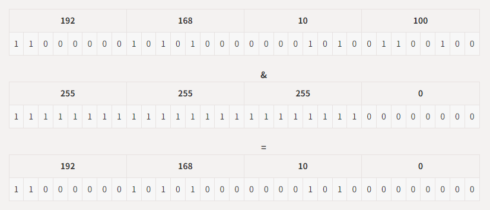

# 네트워킹(Networking)
## 1. 네트워킹(Networking)이란?
* 네트워킹(Networking)이란 두 대 이상의 컴퓨터를 케이블로 연결하여 네트워크(network)를 구성하는 것을 말한다. 네트워킹의 개념은 컴퓨터들을 서로 연결하여 데이터를 손쉽게 주고받거나 또는 자원프린터와 같은 주변기기를 함께 공유하고자 하는 노력에서 시작되었다.
* 초기의 네트워크는 단 몇 대의 컴퓨터로 구성되었으나 지금은 전 세계의 셀 수도 없을만큼 많은 수의 컴퓨터가 인터넷이라는 하나의 거대한 네트워크를 구성하고 있으며, 인터넷을 통해 다양하고 방대한 양의 데이터를 공유하는 것이 가능해졌다.
* 이에 맞춰 메신저나 온라인게임과 같은 인터넷을 이용하는 다양한 네트워크 어플리케이션들이 많이 생겨났다.
* 자바에서 제공하는 java.net패키지를 사용하면 이러한 네트워크 어플리케이션의 데이터통신 부분을 쉽게 작성할 수 있으며, 간단한 네트워크 어플리케이션은 단 몇 줄의 자바코드 만으로도 작성이 가능하다.
***
<br>

### 1.1 클라이언트/서버(client/server)
* '클라이언트/서버'는 컴퓨터간의 관계를 역할로 구분하는 개념이다. 서버(server)는 서비스를 제공하는 컴퓨터(service provider)이고, 클라이언트(client)는 서비스를 사용하는 컴퓨터(service user)가 된다.
* 일반적으로 서버는 다수의 클라이언트에게 서비스를 제공하기 때문에 고사양의 하드웨어를 갖춘 컴퓨터이지만, 하드웨어의 사양으로 서버와 클라이언트를 구분하는 것이 아니기때문에 하드웨어의 사양에 관계없이 서비스를 제공하는 소프트웨어가 실행되는 컴퓨터를 서버라 한다.
* 서비스는 서버가 클라이언트로부터 요청받은 작업을 처리하여 그 결과를 제공하는 것을 뜻하며 서버가 제공하는 서비스의 종류에 따라 파일서버(file server), 메일서버(mail server), 어플리케이션 서버(application server)등이 있다. 예를 들어 파일서버(file server)는 클라이언트가 요청한 파일을 제공하는 서비스를 수행한다.
* 서버에 접속하는 클라이언트의 수에 따라 하나의 서버가 여러 가지 서비스를 제공하기도하고 하나의 서비스를 여러 대의 서버로 제공하기도 한다.
* 서버가 서비스를 제공하기 위해서는 서버프로그램이 있어야 하고 클라이언트가 서비스를 제공받기 위해서는 서버프로그램과 연결할 수 있는 클라이언트 프로그램이 있어야 한다.
  * ex) 웹서버에 접속하여 정보를 얻기 위해서는 웹브라우저(클라이언트 프로그램)가 있어야 하고, FTP서버에 접속해서 파일을 전송받기 위해서는 알FTP와 같은 FTP클라이언트 프로그램이 필요하다.
* 일반 PC의 경우 주로 서버에 접속하는 클라이언트 역할을 수행하지만, FTP Serv-U와 같은 FTP서버프로그램이나 Tomcat과 같은 웹서버프로그램을 설치하면 서버역할도 수행 할 수 있다.
* 파일공유프로그램인 소리바다나 푸르나와 같은 프로그램은 클라이언트프로그램과 서버프로그램을 하나로 합친 것으로 이를 설치한 컴퓨터는 클라이언트인 동시에 서버가 되어 다른 컴퓨터로부터 파일을 가져오는 동시에 또 다른 컴퓨터에게 파일을 제공할 수 있다.
* 네트워크를 구성할 때 전용서버를 두는 것을 서버기반모델(server-based model)이라하고 별도의 전용서버없이 각 클라이언트가 서버역할을 동시에 수행하는 것을 P2P모델(peer-to-peer)이라 한다.
* 서버기반 모델과 P2P모델간의 비교

  | 서버기반 모델(server-based model)                                            | P2P 모델(peer-to-peer model)                                                      |
  |------------------------------------------------------------------------|---------------------------------------------------------------------------------|
  | -안정적인 서비스의 제공이 가능하다.<br/> -공유 데이터의 관리와 보안이 용이하다.<br/>서버구축비용과 관리비용이 든다. | -서버구축 및 운용을 절감할 수 있다.<br/>-자원의 활용을 극대화 할 수 있다.<br/>-자원의 관리가 어렵다.<br/>-보안이 취약하다. |

***
<br>

### 1.2 IP 주소(IP address)
* IP주소는 컴퓨터(호스트, host)를 구별하는데 사용되는 고유한 값으로 인터넷에 연결된 모든 컴퓨터는 IP주소를 갖는다. IP주소는 4 byte(32 bit)의 정수로 구성되어 있으며, 4개의 정수가 마침표를 구분자로'a.b.c.d'와 같은 형식으로 표현된다. 여기서 a, b, c, d는 부호없는 1 byte값, 즉 0~255사이의 정수이다.
* IP주소는 다시 네트워크주소와 호스트주소로 나눌 수 있는데, 32 bit(4 byte)의 IP주소중에서 네트워크주소와 호스트주소가 각각 몇 bit를 차지하는 지는 네트워크를 어떻게 구성하였는지에 따라 달라진다. 그리고 서로 다른 두 호스트의 IP주소의 네트워크주소가 같다는 것은 두 호스트가 같은 네트워크에 포함되어 있다는 것을 의미한다.
* 윈도우즈 OS에서 호스트의 IP주소를 확인하려면 콘솔에서 ipconfig.exe를 실행시키면 된다.
  ```shell
  C:\Documents and Settings\Adminstrator>ipconfig
  
  Windows IP Configuration
  
  Ethernet adapter 로컬 영역 연결:
  
          Connection-specific DNS Suffix  . :
          IP Address. . . . . . . . . . . . . : 192.168.10.100
          Subnet Mask . . . . . . . . . . . . : 255.255.255.0
          Default Gateway . . . . . . . . . . : 192.168.10.1
          
  C:\Documents and Settings\Adminstrator>
  ```
<br>

* 위의 결과에서 얻은 IP주소와 서브넷 마스크를 2진수로 표현하면 다음과 같다.
  <br>(IP주소(192.168.10.100)와 서브넷 마스크(255.255.255.0)의 2진법 표기)
  

<br>

* IP주소와 서브넷 마스크를 비트연산자 '&'로 연산하면 IP주소에서 네트워크 주소만을 뽑아낼 수 있다.
  <br>(IP주소(192.168.10.100)와 서브넷 마스크(255.255.255.0)의 &연산)
  

<br>

* '&'연산자는 bit와 값이 모두 1일 때만 1을 결과로 얻기 때문에 IP주소의 마지막 8 bit는 모두 0이 되었다. 이 결과로부터 IP주소 192.168.10.100의 네트워크 주소는 24bit(192.168.10)이라는 것과 호스트 주소는 마지막 8bit(100)이라는 것을 알 수 있다.
* IP주소에서 네트워크주소가 차지하는 자리수가 많을수록 호스트 주소의 범위가 줄어들기 때문에 네트워크의 규모가 작아진다. 이 경우 호스트 주소의 자리수가 8자리이기 때문에 256개(2의 8승)의 호스트만 이 네트워크에 포함될 수 있다.
* 호스트 주소가 0인 것은 네트워크 자신을 나타내고, 255는 브로드캐스트 주소로 사용되기 때문에 실제로는 네트워크에 포함 가능한 호스트 개수는 254개이다.

<br>

* 이처럼 IP주소와 서브넷 마스크를 '&'연산하면 네트워크 주소를 얻어낼 수 있어서 서로 다른 두 호스트의 IP주소를 서브넷 마스크로 '&'연산을 수행해서 비교하면 이 두 호스트가 같은 네트워크 상에 존재하는지를 쉽게 확인할 수 있다.

***
<br>

### 1.3 InetAddress
* 자바에서는 IP주소를 다루기 위한 클래스로 InetAddress를 제공하며 다음과 같은 메서드가 정의되어 있다.
* InetAddress의 메서드

  | 메서드                                                | 설명                                             |
  |----------------------------------------------------|------------------------------------------------|
  | byte[] getAddress()                                | IP주소를 byte배열로 반환한다.                            |
  | static InetAddress[]<br/>getAllByName(String host) | 도메인명(host)에 지정된 모든 호스트의 IP주소를 배열에<br/>담아 반환한다. |
  | static InetAddress getByAddress(byte[]<br/>addr)   | byte배열을 통해 IP주소를 얻는다.                          |
  | static InetAddress<br/>getByName(String host)      | 도메인명(host)을 통해 IP주소를 얻는다.                      |
  | String getCanonicalHostName()                      | FQDN(fully qualified domain name)을 반환한다.       |
  | String getHostAddress()                            | 호스트의 IP주소를 반환한다.                               |
  | String getHostName()                               | 호스트의 이름을 반환한다.                                 |
  | static InetAddress getLocalHost()                  | 지역호스트의 IP주소를 반환한다.                             |
  | boolean isMulticastAddress()                       | IP주소가 멀티캐스트 주소인지 알려준다.                         |
  | boolean isLoopbackAddress()                        | IP주소가 loopback 주소(127.0.0.1)인지 알려준다.           |

> InetAddress의 주요 메서드들을 활용하는 예제 : [Network01_Ex01](./Network01_Ex01.java)
***
<br>

### 1.4 URL(Uniform Resource Locator)
* URL은 인터넷에 존재하는 여러 서버들이 제공하는 자원에 접근할 수 있는 주소를 표현하기 위한 것으로 ```'프로토콜://호스트명:포트번호/경로명/파일명?쿼리스트링#참조'```의 형태로 이루어져 있다. 여기서 포트번호, 쿼리, 참조는 생략할 수 있다.
> http://www.naver.com:80/sample/hello.html?referer=naver#index1 <br><br>
> 프로토콜 &nbsp;&nbsp;&nbsp;&nbsp;&nbsp;&nbsp;: 자원에 접근하기 위해 서버와 통신하는데 사용되는 통신규약(http)<br>
> 호스트명 &nbsp;&nbsp;&nbsp;&nbsp;&nbsp;&nbsp;: 자원을 제공하는 서버의 이름(www.naver.com)<br>
> 포트번호 &nbsp;&nbsp;&nbsp;&nbsp;&nbsp;&nbsp;: 통신에 사용되는 서버의 포트번호(80)<br>
> 경로명 &nbsp;&nbsp;&nbsp;&nbsp;&nbsp;&nbsp;&nbsp;&nbsp;&nbsp;: 접근하려는 자원이 저장된 서버상의 위치(/sample/)<br>
> 파일명 &nbsp;&nbsp;&nbsp;&nbsp;&nbsp;&nbsp;&nbsp;&nbsp;&nbsp;: 접근하려는 자원의 이름(hello.html)<br>
> 쿼리(query)&nbsp;&nbsp; : URL에서 '?'이후의 부문(referer=naver)<br>
> 참조(anchor) : URL에서 '#'이후의 부분(index1)<br>
> &nbsp;&nbsp;&nbsp;&nbsp;&nbsp;&nbsp;+ HTTP프로토콜에서는 80번 포트를 사용하기 때문에 URL에서 포트번호를 생략하는 경우 80으로 간주한다.<br>
> &nbsp;&nbsp;&nbsp;&nbsp;&nbsp;&nbsp;&nbsp;&nbsp;&nbsp;각 프로토콜에 따라 통신에 사용하는 포트번호가 다르며 생략되면 각 프로토콜의 기본 포트가 사용된다.

* 자바에서는 URL을 다루기 위한 클래스로 URL클래스를 제공하며 당므과 같은 메서드가 정의되어 있다.
* URL의 메서드

  | 메서드                                                                                                                                | 설명                                             |
  |------------------------------------------------------------------------------------------------------------------------------------|------------------------------------------------|
  | URL(String spec)                                                                                                                   | 지정된 문자열 정보의 URL 객체를 생성한다.                      |
  | URL(String protocol, String host, String file)                                                                                     | 지정된 값으로 구성된 URL 객체를 생성한다.                      |
  | URL(String protocol, String host, int port, String file)                                                                           | 지정된 값으로 구성된 URL 객체를 생성한다.                      |
  | String getAuthority()                                                                                                              | 호스트명과 포트를 문자열로 반환한다.                           |
  | Object getContent()                                                                                                                | URL 의 Content객체를 반환한다.                         |
  | Object getContent(Class[] classes)                                                                                                 | URL 의 Content객체를 반환한다.                         |
  | int getDefaultPort()                                                                                                               | URL의 기본 포트를 반환한다.(http는 80)                    |
  | String getFile()                                                                                                                   | 파일명을 반환한다.                                     |
  | String getHost()                                                                                                                   | 호스트명을 반환한다.                                    |
  | String getPath()                                                                                                                   | 경로명을 반환한다.                                     |
  | int getPort()                                                                                                                      | 포트를 반환한다.                                      |
  | String getProtocol()                                                                                                               | 프로토콜을 반환한다.                                    |
  | String getQuery()                                                                                                                  | 쿼리를 반환한다.                                      |
  | String getRef()                                                                                                                    | 참조(anchor)를 반환한다.                              |
  | String getUserInfo()                                                                                                               | 사용자정보를 반환한다.                                   |
  | URLConnection openConnection()                                                                                                     | URL과 연결된 URLConnection을 얻는다.                   |
  | URLConnection openConnection(Proxy proxy)                                                                                          | URL과 연결된 URLConnection을 얻는다.                   |
  | InputStream openStream()                                                                                                           | URL과 연결된 URLConnection의 InputStream<br/>을 얻는다. |
  | boolean sameFile(URL other)                                                                                                        | 두 URL이 서로 같은 것인지 알려준다.                         |
  | void set(String protocol, String host,<br/>int port, String file, String ref)                                                      | URL 객체의 속성을 지정된 값으로 설정한다.                      |
  | void set(String protocol, String host,<br/>int port, String authority, String userInfo,<br/>String path, String query, String ref) | URL 객체의 속성을 지정된 값으로 설정한다.                      |
  | String toExternalForm()                                                                                                            | URL을 문자열로 변환하여 반환한다.                           |
  | URL toURL()                                                                                                                        | URL을 URL로 변환하여 반환한다.                           |

<br>

* URL객체를 생성하는 방법은 다음과 같다.
  ```java
  URL url = new URL("http://www.naver.com/sample/hello.html");
  URL url = new URL("www.naver.com", "/sample/hello.html");
  URL url = new URL("http","www.naver.com",80,"/sample/hello.html");
  ```

<br>

> URL 메서드를 사용한 예제 : [Network01_Ex02](./Network01_Ex02.java)